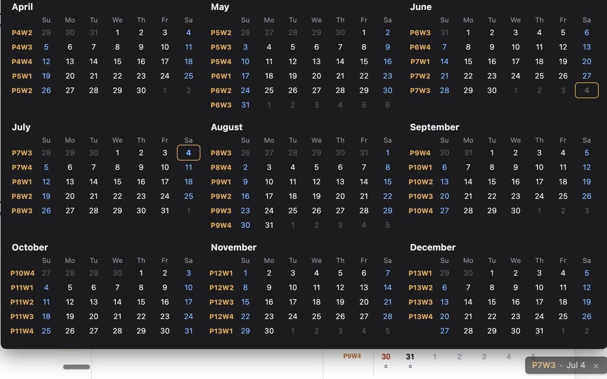

# Period Calendar

A Chrome extension that keeps a year-round 13-period / 4-week calendar visible while you browse. A small pill docked to the bottom-right corner of the page shows today's date and its period/week label; click it to pop up the full year view and jot notes against any date.

## Features

- **Always-on corner pill** — shows today's date and period/week label (e.g. "P7W3 · Jul 4") without getting in the way of the page.
- **Full year calendar** — click the pill to expand into all 12 months, with a period/week label per week row.
- **Per-date notes** — click any date to attach a short note, saved locally and available across every tab.
- **Year navigation** — switch years and every label recalculates instantly.
- **Bulk clear** — wipe all notes for the currently displayed year, with a confirmation step.
- **Print support** — print the calendar with the pill and editing controls hidden.
- **Fully offline** — no network calls, no accounts, no analytics. Everything is stored locally via `chrome.storage.local`.

## The period/week system

- The year is divided into **13 periods** of exactly **4 weeks** each (52 weeks/year).
- Weeks run **Sunday → Saturday**, labeled `P{period}W{week}` (e.g. `P1W1`, `P11W3`).
- For year Y, `P1W1` starts on the **Sunday on or before January 1 of year Y** — so it can start in late December of the prior year.
- Each calendar year's 52-week cycle is computed independently; periods never carry over across a year boundary.
- A handful of trailing days at year-end that fall outside both years' 52-week cycles are shown **without a label**.

Full details are in [period-calendar-requirements.md](period-calendar-requirements.md).

## Installing

This isn't yet published to the Chrome Web Store. To try it now:

1. Clone this repo.
2. Open `chrome://extensions` in Chrome.
3. Enable **Developer mode** (top-right toggle).
4. Click **Load unpacked** and select this repository's folder.

## Privacy

Period Calendar makes no network requests and stores everything (notes, last-viewed year) locally in your browser. See [PRIVACY_POLICY.md](PRIVACY_POLICY.md) for details.

## Development

See [CLAUDE.md](CLAUDE.md) for the architecture and internals (shadow-DOM content script, storage schema, period/week calculation).
